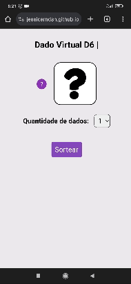

# Dado-Virtual

 

## 🖥️ Projeto
Esse é um projeto de simulação de lançamento de dados giratorios, responsivo. O objetivo desse projeto é fornecer uma experiência interativa de lançamento de dados online.

## 🚀 Tecnologias
Esse projeto foi desenvolvido com as seguintes tecnologias:

- JAVASCRIPT
- HTML
- CSS

